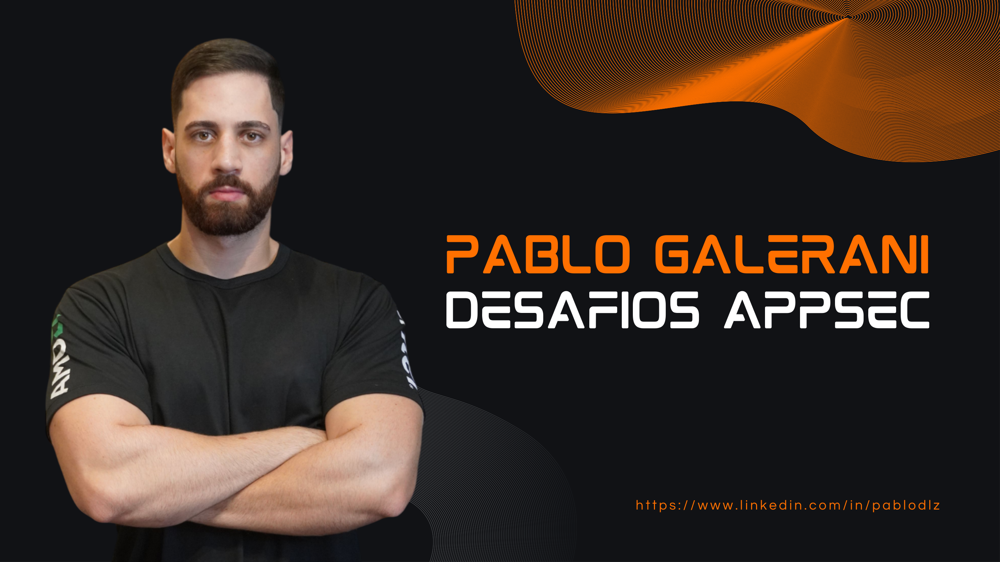
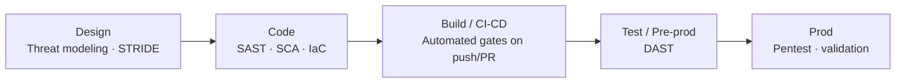

# 🛡️ AppSec & DevSecOps Challenges

**Security from design to offensive validation — the practical backbone of Shift Left.**

📊 **[Full slide deck (PDF)](slides/appsec-devsecops-challenges.pdf)** — the original presentation,
delivered at IFPR and taught as a mini-course at FATEC Ourinhos.

A hands-on journey through **Application Security**, built as a set of progressive
challenges that take security from a design-time activity all the way to offensive
validation — the practical backbone of **DevSecOps** and **Shift Left**.

Each challenge stands on its own but they build in maturity: model the threats *before* code
exists, automate static and dependency analysis *in the pipeline*, validate dynamically, and
finally prove impact with a full exploitation chain. Everything runs on the deliberately
vulnerable **OWASP Juice Shop** (plus a disposable lab VM for the exploitation section), so it
is fully reproducible and safe to practise.

> This material was also **presented at IFPR** and delivered as a **mini-course at FATEC
> Ourinhos** — see [`docs/workshop.md`](docs/workshop.md).

## The challenges

| # | Challenge | Level | Focus | Key tools |
| --- | --- | --- | --- | --- |
| 1 | [SSDLC + Threat Modeling + Frameworks](docs/01-ssdlc-threat-modeling.md) | Basic | Security by Design, STRIDE, vuln management | Microsoft Threat Modeling Tool, OWASP / MITRE / NIST |
| 2 | [SAST automation in CI/CD](docs/02-sast-pipeline.md) | Basic | Static analysis on every push/PR | GitHub Actions, Horusec, Docker |
| 3 | [SAST + SCA + IaC in CI/CD](docs/03-sast-sca-iac-pipeline.md) | Intermediate | Broader coverage, corporate pipeline | Jenkins, Snyk, Docker, NGROK |
| 4 | [DAST + Pentest](docs/04-dast-pentest.md) | Advanced | Dynamic testing + manual validation | OWASP ZAP, OWASP Top 10 |
| Extra | [Enumeration → Exploitation → Privilege Escalation](docs/05-exploitation-privesc.md) | Advanced | Full offensive chain in a lab | nmap, dirb, Burp Suite, netcat, GTFOBins |

## The idea: Shift Left

The challenges are arranged along the software development lifecycle so security shifts *left* —
earlier — where issues are cheaper to fix:

- **SAST** — static analysis of source code.
- **SCA** — software composition analysis (third-party dependencies).
- **IaC** — infrastructure-as-code scanning.
- **DAST** — dynamic analysis of the running app.
- **Pentest** — manual exploitation to confirm real impact.

## A worked artefact

The SAST pipeline (Challenge 2) ships as a ready-to-adapt GitHub Actions workflow:
[`examples/github-actions-security.yml`](examples/github-actions-security.yml).

## What this project demonstrates

- **End-to-end AppSec**, from threat modeling to offensive validation — not a single tool demo.
- **Automation mindset**: security gates that run on every push and pull request.
- **Framework fluency**: OWASP (Top 10, SAMM, ASVS), MITRE ATT&CK, NIST applied to real decisions.
- **Teaching ability**: the same content was presented and taught to others.

## Related repositories

- [`full-chain-web-pentest`](../full-chain-web-pentest/) — the exploitation extra written up in
  full engagement-report form.
- [`writeups`](https://github.com/pablodlz/writeups) — bug bounty and lab field notes.

## License

Written content: **CC BY 4.0**. Pipeline snippets: **MIT**. See [LICENSE](../LICENSE). Part of [`applied-security`](../README.md).

---

*Maintained by [pablodlz](https://github.com/pablodlz) · [portfolio](https://pablodlz.github.io/portfolio/)*
