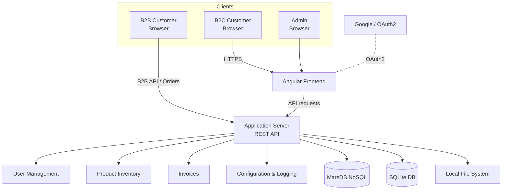

# Challenge 1 — SSDLC, Threat Modeling & Frameworks *(Basic)*

Security starts before the first line of code. This challenge applies **threat modeling with
STRIDE** to OWASP Juice Shop, defines a **Secure SDLC** cycle, and grounds both in the industry
frameworks a security team actually references.

## Secure SDLC (SSDLC) — the cycle

A practical vulnerability-management loop, mapped onto the development lifecycle:

1. **Security by Design (Shift Left)** — at project start: identify assets, model threats, and
   gather requirements with OWASP. During development: SAST, SCA, IaC. At deployment: DAST and pentest.
2. **Assess the threats found** — confirm whether findings are real and understand their impact.
3. **Prioritise** — classify by CVSS, severity, exposure and business context.
   *Severity = Impact + Likelihood.*
4. **Ticket the developers** — open trackable issues (e.g. Jira) and communicate with the dev team.
5. **Fix / mitigate** — patch, update dependencies, change configuration, or mitigate if an
   immediate fix isn't possible.
6. **Re-validate** — re-scan / re-test to confirm the fix worked and didn't reintroduce the flaw.
7. **Document** — record everything, generate indicators, and repeat continuously.

## Data-flow model (DFD)

Before applying STRIDE, the system is modelled as a data-flow diagram with trust boundaries
(built with the **Microsoft Threat Modeling Tool**). Juice Shop, at a high level:

*Trust boundaries sit between the browsers and the frontend, and between the application server
and its data stores — the crossings STRIDE then interrogates.*

## STRIDE analysis (applied to Juice Shop)

| Category | Asset | Threat | Example in Juice Shop | Attack vector | Risk / impact | Suggested control |
| --- | --- | --- | --- | --- | --- | --- |
| **S**poofing | User credentials & sessions | Identity forgery via login with known/weak credentials | Login as admin with leaked credentials | Leaked credentials, brute force | Improper access to sensitive data & functions | Strong auth, brute-force protection, MFA |
| **T**ampering | Request params, cart, prices | Manipulating parameters to alter data or permissions | Changing a product's price with Burp Suite | HTTP request interception/modification | Purchase fraud, financial loss | Backend validation, digital signing, HTTPS |
| **R**epudiation | Action & transaction logs | Denying actions due to missing traceability | No record of coupon misuse | Missing or modifiable logs | Hard to hold malicious users accountable | Secure audit logging, log integrity |
| **I**nformation Disclosure | Sensitive data (users, errors, tokens) | Data exposure via errors or misconfiguration | Error messages; API returning all users | API abuse, error-message mining | Leak of personal/technical information | Error sanitisation, restricted data access, encryption |
| **D**enial of Service | API & infra resources | Overload from malicious requests | Flooding coupon endpoints with invalid requests | Automated scripts, malicious payloads | Service unavailable to legitimate users | Rate limiting, WAF, payload validation |
| **E**levation of Privilege | Permissions & access control | Unauthorised access to restricted functions | Normal user reaching admin area via token manipulation / IDOR | JWT tampering, broken access control | Compromise of data & admin control | Access control, backend permission checks |

## Interactive board

The threat-modeling and challenge planning were also organised on a Miro board:
**[Miro board](https://miro.com/)** — *replace with the exact board URL.*

## Frameworks referenced

- **OWASP Top 10** — the 10 most critical web-app vulnerability categories; prioritises the biggest risks.
- **OWASP SAMM** — a maturity model for security across the whole software lifecycle.
- **OWASP ASVS** — a verification standard / checklist for security controls.
- **MITRE ATT&CK** — a knowledge base of attacker tactics and techniques; feeds threat modeling and defence.
- **NIST** — US standards body; a basis for policy, compliance and maturity assessment.
