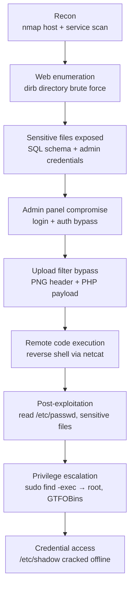

# Full-Chain Web & Host Penetration Test

A complete penetration test — **from an unauthenticated network scan to `root`** — against a
deliberately vulnerable e-commerce web application and its Linux host, documented as a
professional engagement report.

This started as an academic assignment: a four-student security team was handed a lab VM with
no credentials and asked to assess it end-to-end. The result is a full kill chain — recon,
web exploitation, remote code execution, post-exploitation and privilege escalation — with
**18 findings** rated and written up with remediation guidance.

> **Context.** The target is a self-contained lab VM (a vulnerable book-store web app on
> `192.168.56.107`, RFC1918 host-only network) and the "client" is fictitious. This repository
> reconstructs the engagement report as structured text; raw screenshots are intentionally not
> included. Everything documented was performed in an authorised, controlled lab.

## Findings at a glance

| Risk | Count |
| --- | --- |
| **High** | 16 |
| **Medium** | 1 |
| **Low** | 1 |
| **Total** | **18** |

Highlights: SQL injection with full data exfiltration, an image-upload filter bypass leading to
a **PHP reverse shell (RCE)**, local file inclusion, authentication bypasses, plaintext-password
exposure, weak password hashing cracked offline, and a **`sudo`/SUID `find` privilege escalation
to root** (GTFOBins). Full detail in [`docs/findings.md`](docs/findings.md).

## The kill chain



Narrated step by step in [`docs/kill-chain.md`](docs/kill-chain.md).

## Methodology

A standard black-to-white-box methodology in five phases:

1. **Information Gathering** — public/passive information about the target.
2. **Scanning / Enumeration** — services, versions, web directories.
3. **Vulnerability Analysis** — manual identification of entry vectors.
4. **Exploitation & Post-exploitation** — proving impact, pivoting, escalating.
5. **Reporting** — rating each finding and writing actionable remediation.

Details, scope and risk-rating criteria: [`docs/scope-and-methodology.md`](docs/scope-and-methodology.md).

## Tooling

`nmap` · `dirb` · **Burp Suite** · `netcat` · `John the Ripper` · `hashcat` · `hydra` ·
GTFOBins techniques · a Kali Linux attacker box against the lab target.

## What this project demonstrates

- **A complete attack chain**, not an isolated bug — recon → web exploitation → RCE → privilege
  escalation → credential access.
- **Report writing**: each finding has a description, risk rating, evidence-based reasoning and a
  concrete recommendation — the actual deliverable of a pentest.
- **Defensive value**: the [remediation guide](docs/remediation.md) turns every finding into a fix.

## Repository layout

```text
full-chain-web-pentest/
├── docs/
│   ├── scope-and-methodology.md   # engagement scope, methodology, risk criteria
│   ├── kill-chain.md              # the end-to-end narrative, recon to root
│   ├── findings.md                # all 18 findings, rated, with recommendations
│   └── remediation.md             # consolidated hardening guidance
└── README.md
```

## Credits

Carried out by a **four-student team** at FATEC Ourinhos as part of an offensive-security course.
Lead author / write-up: **Pablo Galerani**. *(Teammates are credited in the source report; names
are omitted here pending their consent to public attribution.)*

## License

Written content: **CC BY 4.0**. Snippets: **MIT**. See [LICENSE](../LICENSE). Part of [`applied-security`](../README.md).

---

*Maintained by [pablodlz](https://github.com/pablodlz) · [portfolio](https://pablodlz.github.io/portfolio/)*
