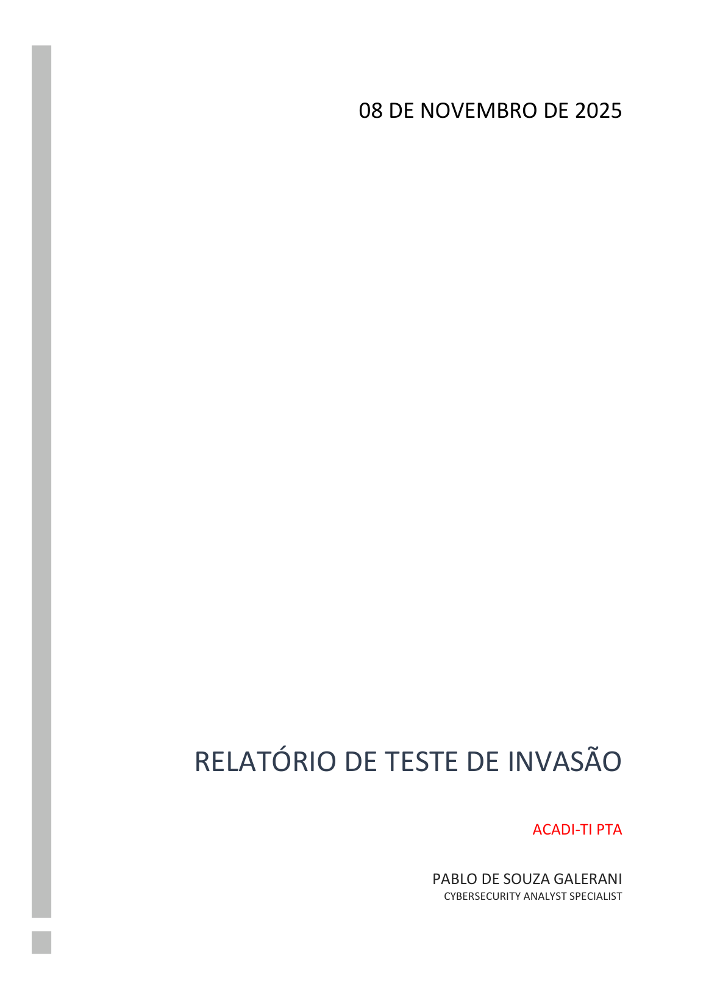
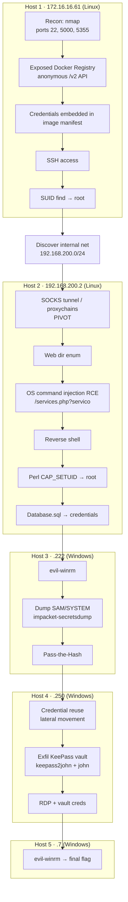

<div align="center">

# 🖥️ Internal Network Penetration Test

**Pivoting one exposed service into privileged access on five servers.**


-orange?style=flat-square)


</div>


<div align="center">

<a href="report/internal-network-pentest-report.pdf"></a>

📄 **[Full engagement report (PDF)](report/internal-network-pentest-report.pdf)** — the original
capstone report (sanitised: personal contact removed). The lab environment (flags, hosts, credentials)
is a disposable training range, reset each year.

</div>

A full internal-network penetration test: **from one exposed service on the perimeter to
privileged access on five servers**, pivoting across a segmented network and chaining Linux and
Windows attacks all the way to a password vault. Produced as the **capstone project of a
postgraduate programme in Offensive Cybersecurity** (2025).

Starting from a single reachable host, the engagement pivots into an internal `192.168.200.0/24`
network and compromises five machines — Linux and Windows — capturing a proof-of-concept flag on
each. It is a complete, report-grade demonstration of recon, exploitation, privilege escalation,
lateral movement and post-exploitation.

> **Context.** This was an authorised assessment of a **training-lab environment** (the programme's
> examination range). This repository reconstructs the engagement report as structured text; flags,
> lab credentials and screenshots are **redacted / omitted** so nothing spoils the lab or exposes
> secrets. Internal RFC1918 lab IPs are kept for narrative clarity.

## Result

- **5 / 5 hosts compromised** with privileged access (root / Administrator).
- **5 / 5 flags** captured.
- **13 findings** — the report tallies **10 High, 3 Medium**.
- Demonstrated **network pivoting** from the entry host into an otherwise-unreachable internal segment.

## The kill chain



Narrated step by step in [`docs/kill-chain.md`](docs/kill-chain.md).

## What this project demonstrates

- **Network pivoting**: reaching an internal segment through a compromised perimeter host (SSH
  dynamic port-forward → SOCKS → `proxychains`).
- **Cross-platform exploitation**: Linux (Docker, SUID, Linux capabilities, OS command injection)
  *and* Windows (SAM/SYSTEM dumping, Pass-the-Hash, credential reuse, RDP).
- **Post-exploitation depth**: credential harvesting, offline hash cracking, password-vault
  extraction.
- **Professional reporting**: an executive summary, a methodology aligned with **NIST SP 800-115**
  and **OWASP**, per-finding severity/complexity ratings, and a remediation plan.

## Tooling

`nmap` · Docker Registry API (`curl`) · `ssh` (dynamic port-forward) · `proxychains` · `dirb` ·
`netcat` · Python reverse shell · SUID/`find` & Linux `capabilities` (GTFOBins) · `evil-winrm` ·
`impacket-secretsdump` · `keepass2john` · `john` / `hashcat` · `xfreerdp`.

## Repository layout

```text
internal-network-pentest/
├── docs/
│   ├── executive-summary.md   # objective, scope, findings summary, action plan, ratings
│   ├── methodology.md         # NIST SP 800-115 / OWASP phases
│   ├── kill-chain.md          # the five-host narrative, entry to final flag
│   ├── findings.md            # all findings, rated, with CWE and recommendations
│   └── remediation.md         # consolidated hardening guidance
└── README.md
```

## About

Solo engagement, planned and executed end-to-end by **Pablo Galerani** — the capstone (PTA) of a
postgraduate specialisation in **Offensive Cybersecurity**, building on a Technologist degree in
Information Security.

Part of [`applied-security`](../README.md). Written content: **CC BY 4.0**; snippets: **MIT** (see [LICENSE](../LICENSE)).

---

*Maintained by [pablodlz](https://github.com/pablodlz) · [portfolio](https://pablodlz.github.io/portfolio/)*
