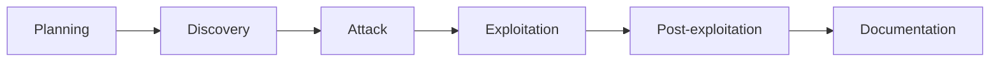

# Methodology

The engagement used a **depth-first** approach — find as many vulnerabilities as possible within the
schedule, exploring each in depth to build an accurate risk picture. For web surfaces it follows
**OWASP**; as a general framework it incorporates **NIST SP 800-115**, with these phases:

## Phases

1. **Planning** — collect information that can feed later attacks: servers, web applications and any
   other data obtainable through tooling or manual technique.
2. **Discovery** — enumerate the environment: live hosts, network devices, in-scope applications,
   service/OS versions and application behaviour.
3. **Attack** — using discovery output, exploit identified flaws across all applicable vulnerability
   classes to gain unauthorised access.
4. **Exploitation** — the highest-impact phase: run the exploits to gain remote access (also where
   brute force / DoS-class attacks would occur, when scheduled).
5. **Post-exploitation** — with access obtained, expand into the internal infrastructure (pivoting),
   harvest credentials, and demonstrate persistence potential. (No destructive action or log-tampering
   was performed against the lab.)
6. **Documentation** — produce this report: each vulnerability described, classified and paired with
   remediation guidance.

## Team

The project was executed **end-to-end by a single professional**, ensuring speed and coherence across
all phases.
